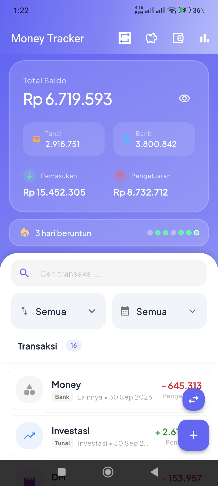
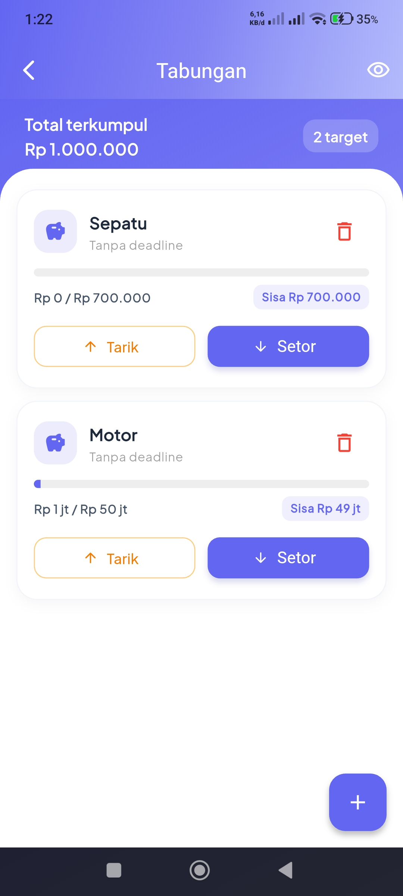

# Money Tracker 💰

Aplikasi pencatat keuangan sederhana yang dibangun dengan **Flutter**. Aplikasi ini membantu Anda memantau pendapatan dan pengeluaran harian dengan antarmuka yang modern dan mudah digunakan.

## ✨ Fitur Utama

- **Ringkasan Saldo**: Lihat total saldo, pemasukan, dan pengeluaran Anda dalam satu kartu ringkasan yang menarik.
- **Catat Transaksi**: Tambahkan transaksi pemasukan atau pengeluaran dengan kategori dan catatan.
- **Riwayat Transaksi**: Daftar transaksi terbaru yang tersusun rapi dengan opsi untuk menghapus.
- **Penyimpanan Lokal**: Data tersimpan aman di perangkat Anda menggunakan Hive database.
- **Desain Modern**: Antarmuka pengguna yang bersih menggunakan Google Fonts (Plus Jakarta Sans) dan Material 3.

## 🚀 Teknologi yang Digunakan

- **Framework**: [Flutter](https://flutter.dev)
- **State Management**: [Flutter BLoC/Cubit](https://pub.dev/packages/flutter_bloc)
- **Local Database**: [Hive](https://pub.dev/packages/hive)
- **Font**: [Google Fonts - Plus Jakarta Sans](https://pub.dev/packages/google_fonts)
- **Formatting**: [Intl](https://pub.dev/packages/intl) untuk format mata uang dan tanggal Indonesia.

## 🛠️ Instalasi

Pastikan Anda sudah menginstal Flutter SDK di komputer Anda.

1. **Clone repositori ini**
   ```bash
   git clone https://github.com/username/money_tracker.git
   cd money_tracker
   ```

2. **Instal dependensi**
   ```bash
   flutter pub get
   ```

3. **Generate file Hive (jika diperlukan)**
   ```bash
   flutter pub run build_runner build --delete-conflicting-outputs
   ```

4. **Jalankan aplikasi**
   ```bash
   flutter run
   ```

## 📸 Cuplikan Layar

| Homepage | Tabungan | Transaksi Rutin |
| :---: | :---: | :---: |
|  |  |  |

| Tren 6 Bulan | Detail Tabungan | Anggaran Pintar |
| :---: | :---: | :---: |
|  |  |  |

## 📁 Struktur Folder

```text
lib/
├── blocs/          # Logika bisnis menggunakan Cubit
├── models/         # Model data (TransactionModel)
├── services/       # Layanan database (Hive)
├── views/          # Halaman aplikasi (Home, Add Transaction)
├── widgets/        # Komponen UI yang dapat digunakan kembali
└── main.dart       # Titik masuk aplikasi
```

---
Dibuat dengan ❤️ menggunakan Flutter.
